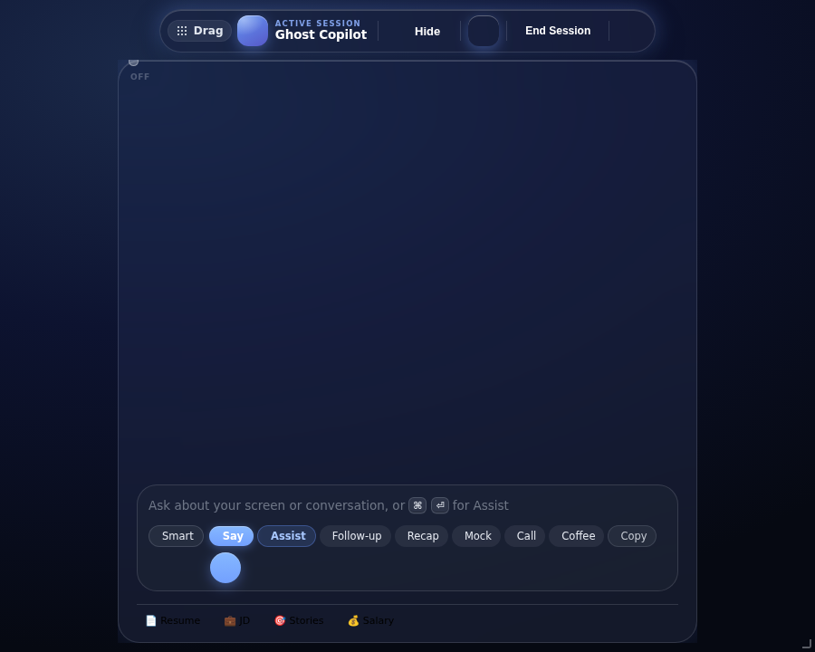

<div align="center">

# 👻 Ghost
### Autonomous Stealth AI Interview & Meeting Copilot

**A multi-surface, translucent AI copilot that sees your screen, listens to meeting audio in real-time, and remains completely invisible to screen shares and proctoring software.**

[](LICENSE)
[](#-multi-surface-architecture)
[](https://www.electronjs.org/)
[](#2-chrome-web-extension-manifest-v3)
[](#3-android-application)



</div>

---

> [!IMPORTANT]
> **Responsible Usage & Privacy Notice**
> Ghost is engineered as a private, self-hosted assistant for interview preparation, live meeting transcription, accessibility, and study. Ghost enforces OS-level window capture exclusion (`setContentProtection(true)` / `WDA_EXCLUDEFROMCAPTURE`) so it cannot be recorded by screen-sharing tools. **You are solely responsible for compliance with all applicable platform policies and recording consent laws.**

---

## ⚡ Instant Run: Pre-Built Downloads (No Build Needed)

If you just want to run Ghost immediately without compiling from source:

| Platform | Download / Package | How to Run |
|---|---|---|
| **🪟 Windows (10/11)** | `Ghost-win-x64.exe` (Installer) or `Ghost-Portable.zip` | Double click the installer, or extract portable and run `ghost.exe` |
| **🐧 Linux (.deb)** | `Ghost-0.2.2-linux-amd64.deb` | `sudo dpkg -i Ghost-0.2.2-linux-amd64.deb` then run `ghost` |
| **🐧 Linux (AppImage)** | `Ghost-0.2.2-linux-x86_64.AppImage` | `chmod +x Ghost-0.2.2-linux-x86_64.AppImage`<br>`./Ghost-0.2.2-linux-x86_64.AppImage --appimage-extract-and-run` |
| **🤖 Android (11+)** | `ghost-mobile-release.apk` | Transfer `.apk` to phone and tap to install, or `adb install -r ghost-mobile-release.apk` |
| **🌐 Chrome / Edge / Brave** | `extension/` (Manifest V3) | Go to `chrome://extensions` → Enable *Developer Mode* → Click *Load Unpacked* → Select `extension/` folder |
| **🍎 macOS (Intel / Apple Silicon)** | `Ghost-mac.zip` / `Ghost.dmg` | Unzip / mount and drag `Ghost.app` to `/Applications` |

---

## 🌟 Multi-Surface Architecture

Ghost operates seamlessly across three surfaces:

```
┌─────────────────────────────────────────────────────────────────────────────┐
│                            GHOST MULTI-SURFACE ECOSYSTEM                    │
├──────────────────────────────┬──────────────────────────────┬───────────────┤
│  🖥️ Desktop App (Electron)   │  🌐 Chrome Extension (MV3)   │ 📱 Mobile App │
│  - Frosted-glass stealth HUD │  - Zero-install browser HUD  │ - iOS Dynamic │
│  - OS-level screen protection│  - Tab audio offscreen pipe  │   Island pill │
│  - System audio loopback     │  - Shadow DOM isolation      │ - Android M3  │
│  - Local whisper.cpp sidecar │  - Multi-provider LLM stream │   call overlay│
└──────────────────────────────┴──────────────────────────────┴───────────────┘
```

### 1. 🖥️ Desktop Application (Electron + Node.js)
* **V2 Frosted-Glass HUD**: Indigo-tinted translucent overlay with a session pill, glass response panel, and pill composer — high contrast for reading answers while keeping eye contact with interviewers.
* **100% Stealth Screen Protection**: OS-level capture exclusion (`WDA_EXCLUDEFROMCAPTURE` on Windows, `NSWindowSharingNone` on macOS, transparent click-through on Linux) makes the overlay invisible to Zoom, Teams, Meet, and proctoring tools.
* **Transcription Containment**: Real-time speech transcription is isolated strictly to the conversation drawer (0px layout jump on composer).
* **Self-Healing LLM Engine**: Fast and Smart reasoning tiers across Google Gemini, OpenAI, Anthropic Claude, Groq, MiniMax, Azure, and Ollama with automatic fallback on quota exhaustion (429) or retired models (404).

### 2. 🌐 Chrome Web Extension (Manifest V3)
* **Zero Installation**: Injects a sleek floating HUD directly into meeting tabs (Google Meet, Zoom Web, Microsoft Teams).
* **Offscreen Tab Audio**: Captures system/meeting audio via `chrome.tabCapture` with isolated Shadow DOM styling.

### 3. 📱 Mobile Application (iOS & Android)
* **Android**: Material 3 design system with `SYSTEM_ALERT_WINDOW` floating call overlay for phone interviews.
* **iOS**: Native Cupertino frosted glass interface with background audio capture support.

---

## ⚡ Key Modes & Hotkeys

| Mode | Trigger | Input Source | Description |
|---|---|---|---|
| **Assist** | `Ctrl` `Enter` (Win/Linux) / `⌘` `↵` (macOS) | Screen + Conversation | Smart contextual response: solves coding problems or suggests next answer |
| **What Should I Say?** | Action Button | Meeting audio + Mic | Generates first-person talking points grounded in your résumé |
| **Follow-up Questions** | Action Button | Conversation History | Predicts interviewer follow-up questions in advance |
| **Recap & Summary** | Action Button | Full Conversation | Summarizes key discussion points and action items |
| **Solve Coding Problem** | `Ctrl` `H` / `⌘` `H` | Screen OCR / Capture | Detects problem statement, outputs optimal solution, complexity, and code |
| **Mock Interview** | Dashboard Mode | Mic + Target Role | AI interviewer asking technical and behavioral questions |
| **Meeting Notes** | Dashboard Mode | Meeting Audio + Mic | Formats clean Markdown meeting notes saved to disk |

---

## 🛠️ Building & Installing From Source

### 1. Desktop App (Windows, macOS, Linux)

#### Prerequisites
- [Node.js](https://nodejs.org/) v22.12.0 or higher
- npm v10+

```bash
# 1. Clone the repository
git clone https://github.com/purvanshbhatt/interview-ghost.git
cd interview-ghost

# 2. Install dependencies
npm install

# 3. Run Ghost in development mode
npm start
```

#### Build Packages from Source
```bash
# Windows x64 Installer (.exe)
npm run dist:win

# Linux x64 (.deb & .AppImage)
npm run dist:linux

# macOS (.zip / .dmg)
npm run dist:mac
```

---

### 2. Chrome Web Extension (Manifest V3)

1. Open Google Chrome, Edge, or Brave and navigate to `chrome://extensions`.
2. Enable **Developer mode** (toggle in the top-right corner).
3. Click **Load unpacked**.
4. Select the `extension/` directory from this repository.
5. Pin the **Ghost** icon to your toolbar and click it to open settings and configure your API keys.

---

### 3. Android Application

#### Prerequisites
- Android SDK & Platform Tools (Android 11+)
- Node.js & npm

```bash
cd mobile
npm install

# Run on connected Android device / emulator via Expo
npm run android

# Build standalone Release APK
cd android
./gradlew assembleRelease
# Output APK: mobile/android/app/build/outputs/apk/release/app-release.apk
```

---

### 4. iOS Application

#### Prerequisites
- macOS with Xcode 15+ and CocoaPods

```bash
cd mobile
npm install

# Run on iOS Simulator
npm run ios

# Open in Xcode for device signing & deployment
cd ios
pod install
open Ghost.xcworkspace
```

---

## 🔑 AI Providers & Configuration

Ghost supports **8 distinct LLM backends**. Bring your own API key — keys are stored strictly on your local device:

| Provider | Recommended Fast Model | Recommended Smart Model | Streaming | Setup Link |
|---|---|---|---|---|
| **Google Gemini** | `gemini-2.5-flash` | `gemini-2.5-pro` | ✅ | [Google AI Studio](https://aistudio.google.com/apikey) |
| **OpenAI** | `gpt-4o-mini` | `gpt-4o` | ✅ | [OpenAI Platform](https://platform.openai.com/api-keys) |
| **Anthropic Claude** | `claude-3-5-haiku-latest` | `claude-3-5-sonnet-latest` | ✅ | [Anthropic Console](https://console.anthropic.com/) |
| **Groq** | `llama-3.1-8b-instant` | `llama-3.3-70b-versatile` | ✅ | [Groq Console](https://console.groq.com/) |
| **MiniMax** | `MiniMax-M2.7` | `MiniMax-M3` | ✅ | [MiniMax Platform](https://platform.minimaxi.com/) |
| **Azure OpenAI** | Custom Fast deployment | Custom Smart deployment | ✅ | [Azure AI Foundry](https://ai.azure.com/) |
| **Ollama** | `llama3.2` (Local) | `llama3.3` (Local) | ✅ | [Ollama](https://ollama.com/) |
| **Custom Endpoint** | Any OpenAI-compatible `/v1/chat/completions` | Any model | ✅ | vLLM, LocalAI |

---

## 🎙️ Speech-to-Text (STT) Options

1. **Gemini Transcribe & Gemini Audio**: High accuracy multi-lingual speech recognition directly via Google Generative Language.
2. **Deepgram Nova-2 / Nova-3**: Cloud streaming STT with ultra-low latency (<300ms).
3. **Local whisper.cpp**: 100% offline, zero-network speech recognition powered by ggml.
4. **Cloud Whisper**: OpenAI Whisper API.

---

## 🛡️ Screen Share Invisibility Setup

Ghost excludes its window from desktop capture pipelines:
- **Windows**: Utilizes `WDA_EXCLUDEFROMCAPTURE` via `SetWindowDisplayAffinity`.
- **macOS**: Sets `NSWindowSharingNone`.
- **Linux**: Transparent click-through overlay.

### 🎥 Zoom Configuration (Recommended)
To ensure Zoom excludes Ghost during full-screen sharing:
> Open **Zoom → Settings → Share Screen → Advanced → Screen capture mode → Select "Advanced capture with window filtering"**.

---

## 🧪 Testing & Verification

Ghost ships with a comprehensive automated test suite covering every module:

```bash
# Run all unit, integration, and E2E tests
npm test
```

---

## 📄 License & Acknowledgments

Ghost is distributed under the **[GNU General Public License v3.0 or later](LICENSE)**.

- Built with [Electron](https://www.electronjs.org/), [React Native / Expo](https://expo.dev/), and [Chrome Extensions Manifest V3](https://developer.chrome.com/docs/extensions/mv3/).
- Offline speech recognition powered by [whisper.cpp](https://github.com/ggml-org/whisper.cpp).
